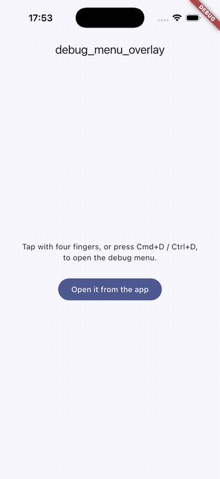
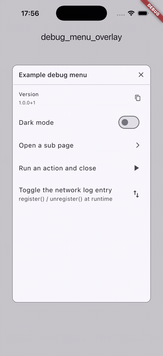
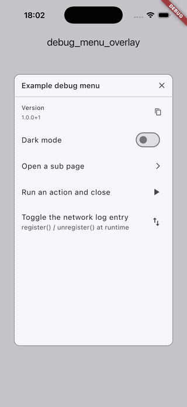

# debug_menu_overlay

4 本指のタップで開くアプリ内デバッグメニューです。  

| 起動画像 | ページ遷移 | ダークモード切り替え |
| --- | --- | --- |
|  |  |  |

## 使い方

```dart
MaterialApp(
  builder: (context, child) => DebugMenuHost(
    enabled: !kReleaseMode,
    items: <DebugMenuItem>[
      DebugMenuItem(
        title: 'Version',
        keywords: const <String>['build', 'flavor'],
        builder: (context, scope) => const DebugMenuInfoTile(
          label: 'Version',
          value: '1.0.0+1',
        ),
      ),
      DebugMenuItem(
        title: 'Reset onboarding',
        builder: (context, scope) => ListTile(
          title: const Text('Reset onboarding'),
          onTap: () {
            resetOnboarding();
            scope.close();
          },
        ),
      ),
      DebugMenuItem(
        title: 'Android exit reasons',
        visibleWhen: () => Platform.isAndroid,
        builder: (context, scope) => ListTile(
          title: const Text('Android exit reasons'),
          // アプリのルーターではなく、デバッグウィンドウの内側に push される。
          onTap: () => Navigator.of(context).push(
            MaterialPageRoute<void>(builder: (_) => const ExitReasonsPage()),
          ),
        ),
      ),
    ],
    child: child!,
  ),
  home: const HomePage(),
);
```

画面に 4 本指で触れる — または Cmd+D / Ctrl+D — とメニューが開きます。外側をタップすると閉じます。

以上を一通り組み込んだ、実際に動かせるアプリが [`example/`](example) にあります。

```sh
cd example && flutter run
```

### ホストをどこに置くか

**`MaterialApp` より下**（`builder` の中か、`home` に渡すものを包む形）に置いてください。そうすれば
ウィンドウがテーマ・文字方向・MediaQuery・material のローカライズを継承できます。同時に**項目が
必要とするものより上**に置いてください。`DebugMenuScope.appContext` はホスト自身の context なので、
項目はさらに上位にあるストア・provider・サービスロケーターを読めます。

```dart
DebugMenuItem(
  title: 'Account',
  builder: (context, scope) => AccountDebugTile(appContext: scope.appContext),
);
```

### 自前の状態管理から開く

既定では起動ジェスチャーがウィンドウを直接開きます。それ以外の場所からもメニューを開く必要がある
場合 — ディープリンク、シェイク検出、redux のアクションなど — は `DebugMenuController` を自分で
保持し、`onActivate` でジェスチャーも同じ経路に通してください。

```dart
DebugMenuHost(
  controller: _controller,          // open() / close() は自分のコードから呼ぶ
  onActivate: () => store.dispatch(OpenDebugMenuAction()),
  items: items,
  child: child,
);
```

### 項目を遅延登録する

各機能が起動時に自分の項目を登録する場合は、`items` ではなく `DebugMenuRegistry` を渡します。

```dart
final registry = DebugMenuRegistry();

registry.register(
  DebugMenuItem(id: 'network', title: 'Network log', builder: ...),
);
registry.unregister('network');
```

`id` を付けて登録した項目は、再登録時に同じ位置で置き換わります。これによりホットリロードや
再初期化で項目が重複しません。

`items` はホストのマウント時に一度だけ読まれます。実行時に登録したエントリがアプリのリビルドで
失われないようにするためです。項目の集合そのものが後から変わる場合は `registry` を渡し、項目を
出したり隠したりしたいだけなら `visibleWhen` を使ってください。

### カスタマイズ

```dart
DebugMenuHost(
  title: 'Internal tools',
  showFilterField: false,
  activation: const DebugMenuActivation(
    pointerCount: 3,
    keyboardShortcut: DebugMenuKeyboardShortcut(key: LogicalKeyboardKey.f12),
  ),
  theme: const DebugMenuWindowTheme(
    widthFactor: 0.9,
    heightFactor: 0.8,
    barrierColor: Color(0x66000000),
    borderRadius: BorderRadius.all(Radius.circular(12)),
  ),
  child: child,
);
```

`DebugMenuActivation.none` はジェスチャーとショートカットの両方を無効にし、コントローラーだけを
唯一の入口にします。結合テストで便利です。

## 既知の制限

- Android の戻るボタンはデバッグウィンドウではなくアプリ自身の navigator が処理します。デバッグ用の
  サブページは AppBar の戻るボタンで pop するか、ウィンドウの外をタップして全体を閉じてください。
- フィルター欄はトップレベルの項目にしか一致しません。項目のサブページの中にネストしたエントリは
  インデックスされません。
- ウィンドウはドラッグやリサイズができず、位置も保存されません。

## ライセンス

LICENSE は [LICENSE](../LICENSE) を参照してください。
